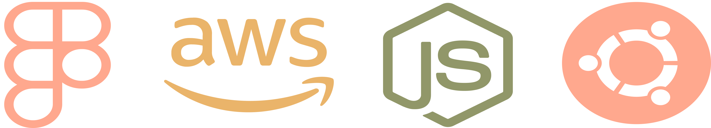
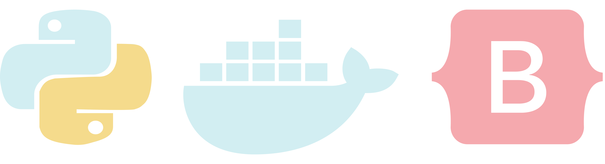

<h2 align='center'>Welcome! Hope you like what you see!</h2>

<h3 align='center'>Favorite Software Technologies</h3>

<h3
 align='center'>Comfortable With</h3
>
<!--
axios
redux
nginx
pm2
vs code
semantic ui
 -->

 

<h3
 align='center'>Familiar With</h3
>

 <!-- 
 java
 adobexd
 linux
 ubuntu
 postman
 unity -->
<h3
 align='center'>Want to Learn</h3
>

<!--
python
Next.js
MongoDB
Bootstrap
Docker
jQuery -->
 
